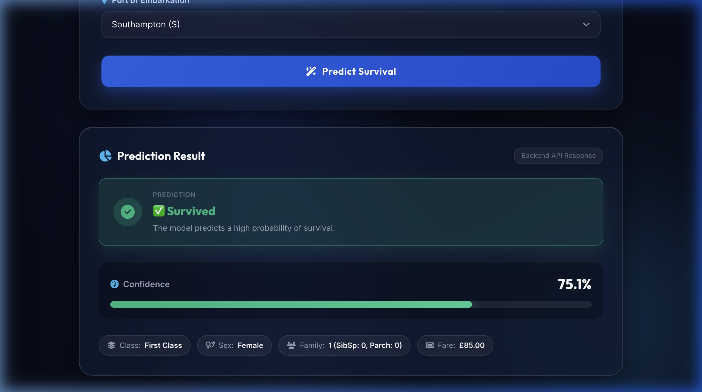
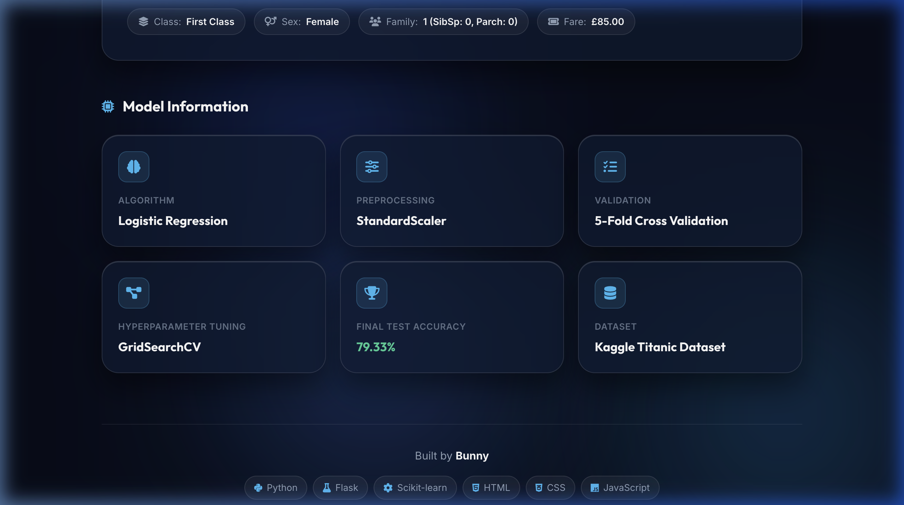

<div align="center">

# 🚢 Titanic Survival Predictor

[](https://titanic-survival-prediction-9xz4.onrender.com)
[](https://github.com/XCodeBunnyX/Titanic-Survival-Prediction)

[](https://www.python.org/)
[](https://flask.palletsprojects.com/)
[](https://scikit-learn.org/)
[](https://developer.mozilla.org/en-US/docs/Web/HTML)
[](https://developer.mozilla.org/en-US/docs/Web/CSS)
[](https://developer.mozilla.org/en-US/docs/Web/JavaScript)
[](https://render.com/)

<p align="center">
  <b>A production-grade AI/ML web application predicting Titanic passenger survival using Scikit-Learn, Flask REST API, and a modern Glassmorphic SaaS UI.</b>
</p>

</div>

---

## 🌐 Live Demo

🔗 **Live Application URL**: [https://titanic-survival-prediction-9xz4.onrender.com](https://titanic-survival-prediction-9xz4.onrender.com)

Experience the live application hosted on Render Cloud. Enter passenger attributes to receive real-time predictions and survival probability metrics calculated directly by the deployed Machine Learning model.

---

## 🐙 GitHub Repository

🔗 **Repository URL**: [https://github.com/XCodeBunnyX/Titanic-Survival-Prediction](https://github.com/XCodeBunnyX/Titanic-Survival-Prediction)

---

## 📌 Project Overview

The **Titanic Survival Predictor** is an end-to-end Machine Learning web application designed to solve the classic Kaggle shipwreck survival problem. The application features a pre-trained **Scikit-Learn Pipeline** (`StandardScaler` + `Logistic Regression`), wrapped in a lightweight, production-configured **Flask REST API**, and presented through a custom **Glassmorphism UI**.

This project demonstrates portfolio-quality engineering practices including pipeline serialization, automated feature engineering, robust API input validation, responsive web design, and continuous cloud deployment via Render.

---

## ✨ Key Features

- **Modern Glassmorphism Design System**: Navy Blue & Crisp White palette, frosted glass containers (`backdrop-filter: blur(20px)`), and smooth micro-interactions.
- **Pre-Trained Machine Learning Model**: Scikit-Learn Pipeline with `StandardScaler` feature scaling and `Logistic Regression` tuned via 5-Fold `GridSearchCV`.
- **Server-Side Feature Engineering**: Automatically computes `FamilySize` (`SibSp + Parch + 1`) and one-hot encodes `Embarked` ports (`Embarked_Q`, `Embarked_S`) on the backend.
- **Robust REST API**: High-performance `POST /predict` endpoint returning structured JSON predictions and numerical probabilities.
- **Interactive Visualizations**: Dynamic probability percentage counter animation, color-coded progress fill bar, and parameter badges.
- **Production Cloud Deployment**: Fully configured for Render using `gunicorn` WSGI server, `render.yaml` Blueprint, and clean environment routing.

---

## 🛠️ Tech Stack

| Domain | Technologies |
| :--- | :--- |
| **Language** | Python 3.10+, JavaScript (ES6+) |
| **Backend Framework** | Flask 3.0+, Flask-CORS, Gunicorn |
| **Machine Learning** | Scikit-Learn, Pandas, NumPy, Joblib |
| **Frontend UI** | HTML5, Vanilla CSS3 (Glassmorphism), Font Awesome 6, Google Fonts (`Outfit` & `Inter`) |
| **Data & Notebooks** | Kaggle Titanic Manifest (`data/train.csv`), Jupyter Notebook (`notebooks/`) |
| **Deployment** | Render Cloud Platform (`render.yaml`) |

---

## 📊 Machine Learning Pipeline

| Parameter | Specification |
| :--- | :--- |
| **Dataset** | Kaggle Titanic Dataset (`data/train.csv`) |
| **Pipeline Architecture** | `StandardScaler` → `Logistic Regression` (`C=0.01`) |
| **Cross-Validation** | 5-Fold Cross Validation |
| **Hyperparameter Optimization** | `GridSearchCV` |
| **Final Test Accuracy** | **79.33%** |
| **Input Feature Vector** | `['Pclass', 'Sex', 'Age', 'SibSp', 'Parch', 'Fare', 'FamilySize', 'Embarked_Q', 'Embarked_S']` |

---

## 🖼️ Application Screenshots

<div align="center">

### Prediction Analysis & Confidence Result


### Model Architecture & Technical Specifications


</div>

---

## 📁 Directory Structure

```
Titanic-Survival-Predictor/
├── app.py                      # Flask REST API Backend & Production Server
├── titanic_model.pkl           # Trained Scikit-Learn Model Pipeline
├── requirements.txt            # Production Python Dependencies
├── render.yaml                 # Render Infrastructure-as-Code Blueprint
├── README.md                   # Complete Portfolio Documentation
├── .gitignore                  # Git Ignore Specifications
│
├── templates/
│   └── index.html              # HTML5 Glassmorphism UI (Jinja2)
│
├── static/
│   ├── style.css               # Custom CSS Glassmorphism Design System
│   └── script.js               # Async Frontend JS & Fetch API Logic
│
├── notebooks/
│   └── Titanic_Survival_Predictor.ipynb   # Jupyter Model Training Notebook
│
├── data/
│   └── train.csv               # Kaggle Titanic Training Dataset
│
└── screenshots/                # Application Screenshots
    ├── prediction_result_card.png
    └── model_info_footer.png
```

---

## 🔌 API Endpoint Specification

### `POST /predict`

**Headers**: `Content-Type: application/json`

#### Example Request Payload:
```json
{
  "Pclass": 1,
  "Sex": "female",
  "Age": 29.0,
  "Fare": 85.0,
  "SibSp": 0,
  "Parch": 0,
  "Embarked": "S"
}
```

#### Example JSON Response:
```json
{
  "prediction": "Survived",
  "prediction_value": 1,
  "probability": 75.11
}
```

---

## 💻 Local Setup & Installation

### 1. Clone the Repository
```bash
git clone https://github.com/XCodeBunnyX/Titanic-Survival-Prediction.git
cd Titanic-Survival-Prediction
```

### 2. Create & Activate Virtual Environment
```bash
python3 -m venv venv
source venv/bin/activate    # On Windows: venv\Scripts\activate
```

### 3. Install Dependencies
```bash
pip install -r requirements.txt
```

### 4. Run the Application
```bash
python3 app.py
```
Open **http://localhost:5001** (or `http://localhost:5000`) in your browser.

---

## ☁️ Running Production Deployment on Render

This project includes a pre-configured `render.yaml` Blueprint:

1. Log into your **[Render Dashboard](https://dashboard.render.com/)**.
2. Select **New +** → **Blueprint**.
3. Connect repository `XCodeBunnyX/Titanic-Survival-Prediction`.
4. Render will automatically build dependencies via `pip install -r requirements.txt` and launch `gunicorn app:app`.

---

## 🔮 Future Improvements

- [ ] Add SHAP / LIME explainable AI breakdown cards for feature contribution scores.
- [ ] Support ensemble comparison models (Random Forest, XGBoost, LightGBM).
- [ ] Add interactive scenario comparison mode for historical passenger profiles.
- [ ] Implement automated CI/CD pipeline via GitHub Actions.

---

## 👤 Author

**Bunny** — *CodeXBunny AI Team*  
- GitHub: [@XCodeBunnyX](https://github.com/XCodeBunnyX)
- Project Repository: [Titanic-Survival-Prediction](https://github.com/XCodeBunnyX/Titanic-Survival-Prediction)
